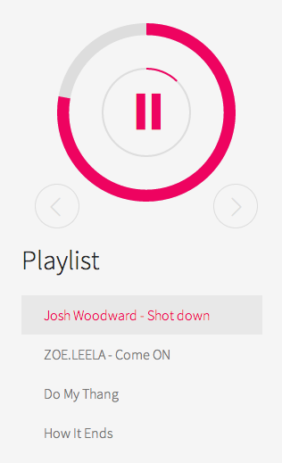
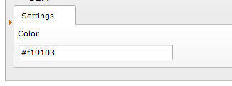

HTML5 Audio Player
==================

Let your visitors hear your audible beauty with the HTML5 audioplayer TYPO3 extension.

Simply add Songs in the backend and have them presented in a visually appealing way using state of the art HTML5 Elements and JavaScript.

How to embed
------------
Download and paste the extension in your ext folder, be sure that the name is "nim_html5audioplayer". Install the TYPO3 extension.

Features
--------

- No dependencies at all (no jQuery, nothing)

- Change the colorsheme to match your brand

 

- working flawlessly on mobile devices

- active development by [NIMIUS](http://nimius.net)

- easily style the player yourself to achieve custom styles

- using [Jim Knopf by eskimoblood](https://github.com/eskimoblood/jim-knopf)

Customization
-------------

- Change the color in the extension settings

- Use the file `Resources/Public/css/main.scss` as a starting point for your own design

- If you are not using TYPO3: Use the file `Resources/Public/js/player.js` along with a copy of the [forked version of Jim Knopf](https://github.com/thephpjo/jim-knopf) (Standalone version of HTML5audioplayer coming soon)

Licence
-------

The MIT License (MIT)

Copyright (c) 2014 [NIMIUS](http://nimius.net)

__TLDR: take it, use it, have fun with it__

Permission is hereby granted, free of charge, to any person obtaining a copy
of this software and associated documentation files (the "Software"), to deal
in the Software without restriction, including without limitation the rights
to use, copy, modify, merge, publish, distribute, sublicense, and/or sell
copies of the Software, and to permit persons to whom the Software is
furnished to do so, subject to the following conditions:

The above copyright notice and this permission notice shall be included in
all copies or substantial portions of the Software.

THE SOFTWARE IS PROVIDED "AS IS", WITHOUT WARRANTY OF ANY KIND, EXPRESS OR
IMPLIED, INCLUDING BUT NOT LIMITED TO THE WARRANTIES OF MERCHANTABILITY,
FITNESS FOR A PARTICULAR PURPOSE AND NONINFRINGEMENT. IN NO EVENT SHALL THE
AUTHORS OR COPYRIGHT HOLDERS BE LIABLE FOR ANY CLAIM, DAMAGES OR OTHER
LIABILITY, WHETHER IN AN ACTION OF CONTRACT, TORT OR OTHERWISE, ARISING FROM,
OUT OF OR IN CONNECTION WITH THE SOFTWARE OR THE USE OR OTHER DEALINGS IN
THE SOFTWARE.